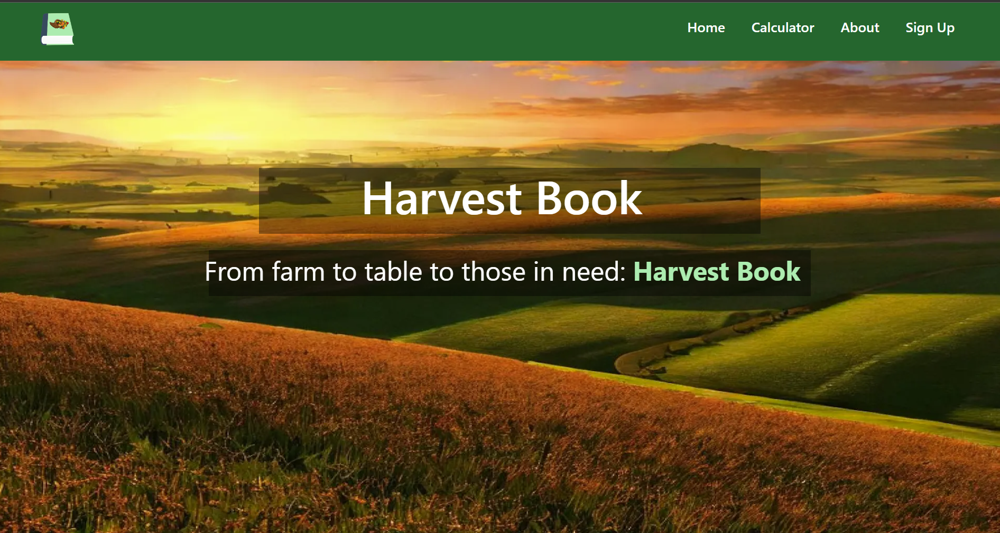
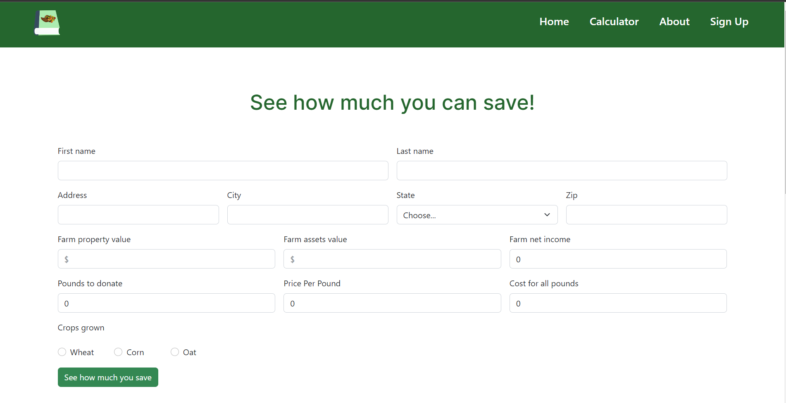
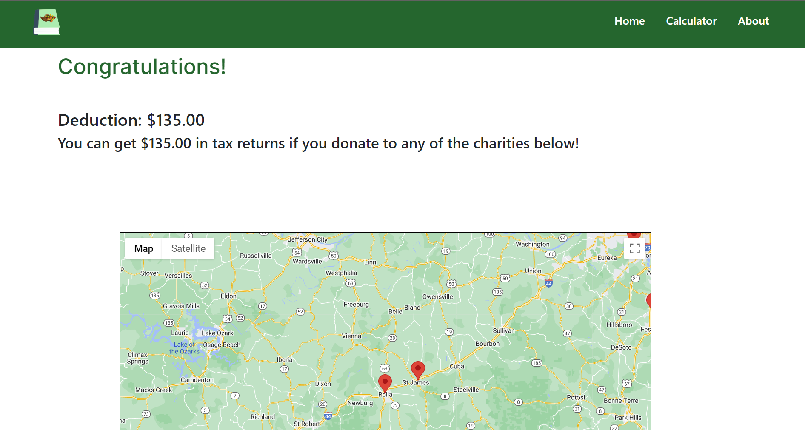

# harvest-book 

  
 

 
 ## Quick Links
[__Installation Instructions__](harvest-book/README.md)
  

## Description
Harvest Book is a website that provides a platform for farmers to donate their excess food to charities, reducing food waste and decay while also providing tax benefits for the farmers. By connecting farmers directly with local charities and food banks, Harvest Book streamlines the process of donating surplus crops and helps ensure that food gets to those who need it most. Additionally, farmers can receive tax benefits for donating their excess produce, providing an added incentive to participate in this sustainable and charitable initiative. With Harvest Book, farmers can easily reduce their environmental impact, help their local communities, and receive financial benefits at the same time.
  

## Website
 
 
 
  

## Technologies Used

  

## Contributors

